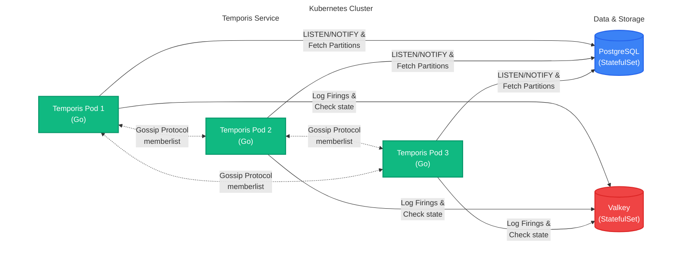

# Temporis

A distributed microservice written in Go, designed to manage timers across
partitions with no overlap, deployable on Kubernetes. The service uses
consistent hashing for partition distribution, a gossip protocol for service
discovery, PostgreSQL for configuration storage, and Valkey for logging timer
firings.

## Features

- **Distributed Coordination:** Uses HashiCorp's `memberlist` for cluster
  membership and gossip protocol.
- **Consistent Hashing:** Dynamically distributes partitions across active
  nodes.
- **Real-time Synchronization:** Leverages PostgreSQL `LISTEN/NOTIFY` for
  instant state syncing without polling bottlenecks.
- **Persistent Configuration:** Stores partitions and timer definitions securely
  in PostgreSQL.
- **Execution Tracking:** Logs timer firings to Valkey, keeping a rolling
  history of the last 10 firings per timer.
- **Delivery Guarantee:** Provides at-most-once delivery for one-time timers.
  Partition rebalances seamlessly resume countdowns without resetting intervals.
- **Thundering Herd Protection:** Employs deterministic hashing and volume-based
  SLA jitter (1-minute buckets, up to 1-hour spread) to perfectly balance massive
  catch-up executions during recovery without thrashing the database connection pool.

## Architecture



The service is built as a Go microservice with the following components:

- **Gossip Protocol**: Manages cluster membership, detecting node joins/leaves
  using `memberlist`.
- **Consistent Hashing**: Distributes partitions across nodes to ensure balanced
  and non-overlapping ownership.
- **Partition Manager**: Executes timers (one-time or recurring) for owned
  partitions.
- **Storage**:
  - **PostgreSQL**: Persists partition and timer configurations.
  - **Valkey**: Logs timer firings (last 10 per timer) for auditing or
    downstream processing.
- **Service Logic**: Orchestrates partition distribution, timer execution, and
  cluster synchronization.

## Setup & Deployment

1. **Clone the Repository**

   ```bash
   git clone https://github.com/robbdimitrov/temporis.git
   cd temporis
   ```

2. **Deploy the Cluster**
   ```bash
   ./scripts/deploy.sh
   ```

### How the Database is Initialized

During deployment, `scripts/deploy.sh` automatically packages
`pkg/database/schema.sql` into a Kubernetes `ConfigMap`. The PostgreSQL
`StatefulSet` mounts this map directly into `/docker-entrypoint-initdb.d/`. When
the database pod starts for the very first time, it automatically executes this
script to:

1. Create the `partitions` and `timers` tables.
2. Set up `LISTEN/NOTIFY` triggers on both the `partitions` and `timers`
   tables (channel: `config_changed`).
3. Seed the database with sample partitions (`partition-1` through
   `partition-6`) and 20 randomly assigned timers.

You do not need to initialize the database manually.

### Verify Deployment

- Check pod status:
  ```bash
  kubectl get pods -l app=temporis
  ```
- View logs to confirm partition assignment and timer firings:
  ```bash
  kubectl logs -l app=temporis
  ```
- Check Valkey for timer firing records:
  ```bash
  valkey-cli -h <valkey-host> KEYS "firings:*"
  ```

## Usage

The service automatically:

1. Joins the gossip cluster to discover other pods.
2. Loads partitions and timers from PostgreSQL.
3. Assigns partitions using consistent hashing based on the gossip member list.
4. Executes timers (one-time or recurring) for owned partitions.
5. Logs timer firings to Valkey.

### Adding Partitions and Timers

Insert new partitions or timers into PostgreSQL:

```sql
INSERT INTO partitions (id) VALUES ('partition-7');
INSERT INTO timers (partition_id, name, interval_ms, once) VALUES ('partition-7', 'timer-21', 2000, false);
```

The service will instantly detect the change via PostgreSQL `LISTEN/NOTIFY`
(`config_changed` channel), which fires on both `partitions` and `timers`
table mutations.

### Monitoring

- **Logs**: Monitor pod logs for node joins/leaves, partition assignments, and
  errors.
- **Valkey**: Inspect `firings:<timer-id>` lists for timer execution history
  (stores the last 10 firing timestamps per timer).

## How It Works

1. **Service Startup**:
   - Loads configuration (e.g., database URLs, gossip port).
   - Initializes PostgreSQL, Valkey, and gossip protocol.
   - Starts PostgreSQL listener for real-time `LISTEN/NOTIFY` synchronization.

2. **Gossip Protocol**:
   - Pods discover each other via a headless Kubernetes service (`temporis`).
   - The `memberlist` library maintains an up-to-date list of active pods,
     detecting failures or scaling events.

3. **Consistent Hashing**:
   - Maps partitions to pods using a hash ring.
   - Updates the ring when pods join or leave (via `AddNode` and `RemoveNode`).
   - Ensures no partition overlap by assigning each partition to exactly one
     pod.

4. **Partition and Timer Management**:
   - Each pod manages its assigned partitions, loaded from PostgreSQL.
   - Timers (one-time or recurring) are executed via goroutines, with firings
     logged to Valkey.
   - Partitions are reassigned dynamically when the cluster changes.

5. **Node Removal**:
   - When a pod leaves (e.g., due to failure or scaling), it’s removed from the
     gossip member list.
   - The hash ring is updated to exclude the node, and its partitions are
     reassigned to other pods.
   - Timers for unowned partitions are stopped gracefully using context
     cancellation.

## Development

### Debugging

- Enable verbose logging in `memberlist` by setting `LogOutput` in
  `gossip.NewGossipManager`.
- Add debug logs in `service.syncWithCluster` to track node and partition
  changes.

## Troubleshooting

- **Pods Not Discovering Each Other**:
  - Verify the headless service (`kubectl get svc temporis`).
  - Check gossip port (7946) is open and not blocked by network policies.
- **Partitions Not Assigned**:
  - Ensure partitions exist in PostgreSQL.
  - Check logs for hash ring updates and errors.
- **Timer Firings Missing**:
  - Verify Valkey connectivity and inspect `firings:*` keys.
  - Confirm timer intervals are reasonable (e.g., not too short).

## Contributing

1. Fork the repository.
2. Create a feature branch (`git checkout -b feature/xyz`).
3. Commit changes (`git commit -m "Add feature xyz"`).
4. Push to the branch (`git push origin feature/xyz`).
5. Open a pull request.

## License

MIT License. See [LICENSE](LICENSE) for details.
